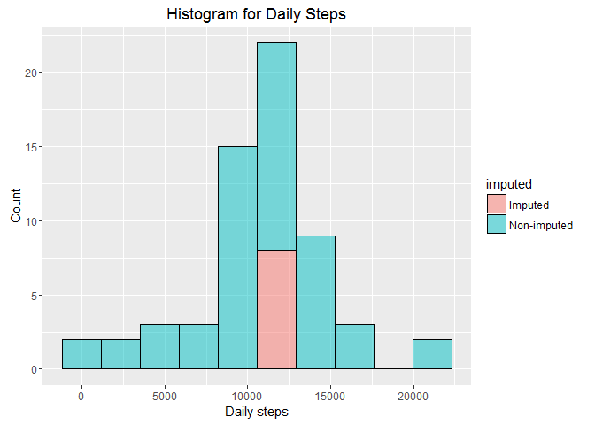

# Reproducible Research: Peer Assessment 1


## Loading and preprocessing the data
Data is loaded and processed for the analysis.

```r
activity <- read.csv("activity.csv", header=TRUE)
str(activity)
```

```
## 'data.frame':	17568 obs. of  3 variables:
##  $ steps   : int  NA NA NA NA NA NA NA NA NA NA ...
##  $ date    : Factor w/ 61 levels "2012-10-01","2012-10-02",..: 1 1 1 1 1 1 1 1 1 1 ...
##  $ interval: int  0 5 10 15 20 25 30 35 40 45 ...
```

```r
activity$date <- as.Date(activity$date)
head(activity)
```

```
##   steps       date interval
## 1    NA 2012-10-01        0
## 2    NA 2012-10-01        5
## 3    NA 2012-10-01       10
## 4    NA 2012-10-01       15
## 5    NA 2012-10-01       20
## 6    NA 2012-10-01       25
```

## What is mean total number of steps taken per day?
Total number of steps taken per day is calculated and a histogram made (ignoring missing values).

```r
activity_day <- aggregate(steps ~ date, FUN = sum, data = activity)
library(ggplot2)
hist1 <- ggplot(activity_day, aes(steps)) + 
        geom_histogram(bins = 10, col="black", fill="deepskyblue", alpha=0.5) + 
        labs(title="Histogram for Daily Steps") +
        labs(x="Daily steps", y="Count")
hist1
```

<!-- -->

Mean and median of the total number of steps taken per day are calculated.

```r
mean1 <- mean(activity_day$steps)
mean1
```

```
## [1] 10766.19
```

```r
median1 <- median(activity_day$steps)
median1
```

```
## [1] 10765
```
The mean is 10766.19 and the median is 10765.

## What is the average daily activity pattern?
A time series plot of the 5-minute interval and the average number of steps taken, averages across all days is made.

```r
activity_5min <- aggregate(steps ~ interval, FUN = mean, data = activity)

tsplot1 <- ggplot(activity_5min, aes(interval, steps)) + geom_line() +
        xlab("5-minute interval") + ylab("Average number of steps taken")
tsplot1
```

<!-- -->

The 5-minute interval that contains, on average across all the days in the dataset, the maximum number of steps is calculated.

```r
int_maxsteps <- activity_5min$interval[which.max(activity_5min$steps)]
int_maxsteps
```

```
## [1] 835
```

This 5-minute interval is the 835 th of the day.
 
## Imputing missing values
Total number of missing values in the dataset is calculated.

```r
nrowNAs <- sum(!complete.cases(activity))
nrowNAs
```

```
## [1] 2304
```

```r
library(scales)
percentNA <- percent(nrowNAs/nrow(activity))
percentNA
```

```
## [1] "13.1%"
```
The number of rows with NAs is 2304 which represents the 13.1%of the total number of observations.

Variables containing NAs are investigated.

```r
sum(is.na(activity$steps))
```

```
## [1] 2304
```

```r
sum(is.na(activity$date))
```

```
## [1] 0
```

```r
sum(is.na(activity$interval))
```

```
## [1] 0
```
There are NA values only for the "steps" variable. Missing values are filled by imputing the mean value of steps for that 5-minute interval. A new dataset is created equal to the original dataset but with the missing data filled in.

```r
activity2 <- activity
for (i in 1:length(activity2$steps)){
        if(is.na(activity2$steps[i])){
                activity2$steps[i] <- activity_5min$steps[match(activity2$interval[i],
                                                             activity_5min$interval)]
                activity2$imputed[i] <- "Imputed"
        }
        else {activity2$imputed[i] <- "Non-imputed"}
}
```

A histogram of the total number of steps taken each day is made (using dataset with imputed data).

```r
activity2_day <- aggregate(steps ~ date+imputed, FUN = sum, data = activity2)
hist2 <- ggplot(activity2_day, aes(steps, fill=imputed)) + 
        geom_histogram(bins = 10, col="black", alpha=0.5) + 
        labs(title="Histogram for Daily Steps") +
        labs(x="Daily steps", y="Count")
hist2
```

<!-- -->

Mean and median total number of steps taken per day (using dataset with imputed data) are calculated.

```r
mean2 <- mean(activity2_day$steps)
mean2
```

```
## [1] 10766.19
```

```r
median2 <- median(activity2_day$steps)     
median2
```

```
## [1] 10766.19
```
The mean is 10766.19 and the median is 10766.19. The mean is the same value given that the imputed values are means of the other values. Median value is slightly higher, but the difference is insignificant given that imputed values (mean) are in the center of the data.

## Are there differences in activity patterns between weekdays and weekends?
(For the next steps, dataset with imputed data is used)  
A new factor variable with two levels ("weekday" vs "weekend") is created in the dataset, indicating wheter a given date is a weekday or weekend day.

```r
activity2$weekday <- weekdays(activity2$date) 
activity2$daytype <- ifelse(activity2$weekday %in% c("sábado","domingo"), "weekend", "weekday")
```
A panel plot containing a time series plot of the 5-minute interval and the average number of steps taken, averaged across all weekday days or weekend days is made.

```r
activity2_5min <- aggregate(steps ~ interval + daytype, FUN = mean, data = activity2)
ggplot(activity2_5min, aes(interval, steps)) + geom_line() +
        xlab("5-minute interval") + ylab("Average number of steps taken") +
        facet_grid(daytype ~ .) 
```

<!-- -->
